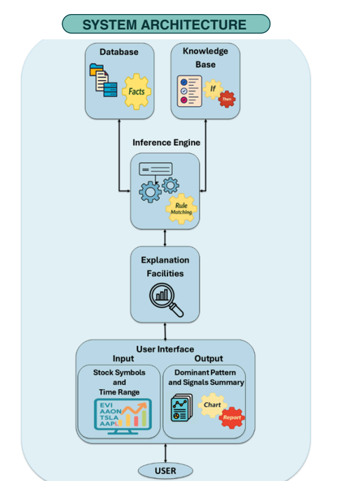

#  Stock Market Expert System

A rule-based expert system that automatically analyzes stock market 
patterns using daily price and volume data.

Built with Python | Tkinter | Pandas | Matplotlib

---

##  What It Does

This system applies IF-THEN rules to detect dominant trading 
patterns for any stock, helping users make faster and clearer 
decisions without manual analysis.

---
## System Architecture

---
##  How It Works

- **Knowledge Base:** predefined rules for price-action and volume patterns
- **Inference Engine:** Matches daily OHLC data against the rules
- **Explanation Facility:** Provides a plain-English explanation for each detected pattern
- **GUI:** Compare two stocks side-by-side, view charts, and export reports

---

##  Detected Patterns

| Pattern | Type |
|--------|------|
| Bullish / Bearish Close | Price Action |
| Strong Uptrend / Downtrend Day | Price Action |
| Consolidation / Indecision | Price Action |
| Strong Positive / Negative Jump | Price Action |
| Stock Accumulation / Distribution | Volume |
| Suspicious Low-Volume Move | Volume |

---

## Features

- Analyze up to 2 stocks simultaneously
- Select analysis period: Last Day / Week / Month / 3 or 5 Months
- Visual comparison chart (Close Price)
- Export full report as .txt file
- Searchable ticker list from local data folder

---

##  Project Structure
Stock-Expert-System/

│

├── main_app.py          # GUI and main application

├── expert_system.py     # Inference Engine + Rules

├── data_utils.py        # Data loading and feature engineering

├── Stock_Data/          # CSV files (one per stock ticker)

└── background1.png      # UI background image

---

## How to Run

1. Install requirements:
pip install pandas matplotlib pillow

2. Place your stock CSV files inside the `Stock_Data/` folder.
   Each file should be named `TICKER.csv` and contain:
   `Date, Open, High, Low, Close, Volume`

3. Run the application:
python main_app.py

---

## Built By
Sharifa Alzubadi 
